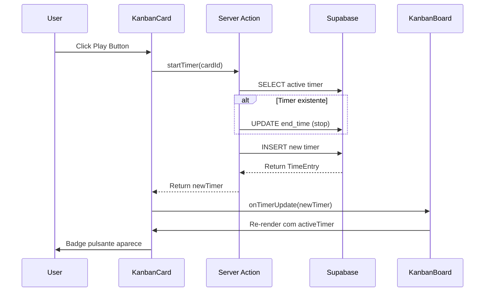

# 📋⏱️ Feature Documentation: Kanban + Native Time Tracking (Clockify Killer)

**Versão:** 2.0  
**Data:** 07 de Fevereiro de 2026  
**Status:** ✅ IMPLEMENTADO  

---

##  1. Visão Geral

O sistema Kanban do Kyrie OS evoluiu de um board simples para uma solução completa de gestão de tarefas com **cronometragem nativa integrada**, eliminando completamente a necessidade de ferramentas externas como Clockify ou Toggl.

### 📍 Localizações Principais
- **Kanban por Cliente:** `/kyrie/clients/[slug]/kanban`
- **Master Kanban (Visão Global):** `/kyrie/workspace/kanban`

---

## 2. Sistema Kanban Core

### 2.1 Arquitetura de Dados

```yaml
Tabelas Principais:
  - kanban_columns: Colunas customizáveis por cliente
  - kanban_cards: Cards/Tarefas com ICE Score
  - kanban_labels: Labels reutilizáveis por organização
  - kanban_time_entries: ⭐ NOVO - Entradas de tempo
```

### 2.2 Funcionalidades do Board

#### Colunas
- **Criação Dinâmica:** Adicione/remova colunas por cliente
- **Ordenação:** Arraste colunas para reordenar
- **Coluna de Concluído:** Marca automaticamente cards como concluídos
- **WIP Limit (Futuro):** Limite de trabalho em progresso

#### Cards
- **Drag and Drop:** Movimentação fluida entre colunas usando `@dnd-kit`
- **ICE Score:** Cálculo automático de prioridade (Impact × Confidence / Effort)
- **Labels Coloridas:** Categorização visual
- **Quick Add:** Criação rápida sem modal
- **Hover Actions:** Botões de ação aparecem ao passar o mouse

### 2.3 Master Kanban (Visão Agregada)

**Localização:** `/kyrie/workspace/kanban`

```yaml
Funcionalidades Especiais:
  - Visualização unificada de TODOS os clientes
  - Badges de cliente: Cada card mostra a sigla do cliente (ex: [ADE])
  - Gerenciamento global de colunas: 
      Criar coluna no Master → Propaga para todos os clientes
  - Filtros por cliente, label, status
```

**Casos de Uso:**
- Visão geral da carga de trabalho de toda a empresa
- Priorização cross-client
- Identificação de gargalos

---

## 3. ⏱️ Time Tracking Nativo ("Clockify Killer")

### 3.1 Problema Resolvido

```
ANTES (Clockify):
├── Abrir Clockify em outra aba
├── Buscar projeto/tarefa
├── Iniciar cronômetro
├── Lembrar de parar ao mudar de tarefa
├── Dados isolados da gestão de tarefas
└── Custo mensal por usuário

AGORA (Kyrie OS):
├── Timer integrado NO card do Kanban
├── Quick Start: 1 clique no card
├── Auto-stop ao iniciar novo timer
├── Histórico de logs NO próprio card
├── Dados centralizados
└── Sem custo adicional ✅
```

### 3.2 Database Schema

```sql
-- kanban_time_entries
CREATE TABLE kanban_time_entries (
  id UUID PRIMARY KEY DEFAULT gen_random_uuid(),
  card_id UUID NOT NULL REFERENCES kanban_cards(id) ON DELETE CASCADE,
  user_id UUID NOT NULL REFERENCES auth.users(id),
  
  -- Tempo
  start_time TIMESTAMPTZ NOT NULL DEFAULT NOW(),
  end_time TIMESTAMPTZ,
  duration_seconds INTEGER, -- Calculado ao parar
  
  -- Metadados
  description TEXT,
  is_manual BOOLEAN DEFAULT FALSE,
  
  -- Timestamps
  created_at TIMESTAMPTZ DEFAULT NOW(),
  updated_at TIMESTAMPTZ DEFAULT NOW()
);

-- Constraint: Somente 1 timer ativo por usuário
CREATE UNIQUE INDEX idx_active_timer_per_user 
  ON kanban_time_entries(user_id) 
  WHERE end_time IS NULL;
```

### 3.3 Componentes Implementados

#### `TimerBadge.tsx`
Badge pulsante que mostra o tempo decorrido em tempo real.

```tsx
<TimerBadge startTime={activeTimer.start_time} />
// Output: "⏱️ 01h 23m 45s" (atualiza a cada segundo)
```

**Features:**
- Conta regressiva visual
- Pulsa em vermelho enquanto ativo
- Animação de ênfase

#### `KanbanCard.tsx` - Quick Start Button
Botão de Play que aparece ao passar o mouse sobre o card.

```yaml
Comportamento:
  - Hover no card → Botão Play aparece
  - Clique no Play → Inicia timer DESTE card
  - Se houver timer ativo em outro card → Para automaticamente
  - Badge vermelho pulsante → Aparece indicando timer ativo
```

#### `KanbanCardDetails.tsx` - Controles Completos
Modal de detalhes do card com seção dedicada ao tempo.

**Seção "Rastreamento de Tempo":**
1. **Header com controles:**
   - Timer ao vivo (se ativo)
   - Botão Start (se parado)
   - Botão Stop (se rodando)
   - Tempo total gasto no card

2. **Tabela de Logs:**
   - Data/hora de início
   - Duração formatada (ex: "1h 23m")
   - Opção de deletar entrada (Futuro)

### 3.4 Regras de Negócio (Críticas)

```yaml
Concorrência (Single Active Timer):
  - Somente 1 timer pode estar ativo POR USUÁRIO
  - Ao iniciar novo timer → Para o anterior automaticamente
  - Garante precisão nos dados
  - Evita esquecimento de parar timer

Persistência:
  - Timer sobrevive a recarregamento de página
  - Estado guardado no banco de dados
  - Tempo calculado server-side (evita manipulação)

Auto-Stop em Cards Concluídos:
  - Cards em coluna "Done" → Timer para automaticamente
  - Registra tempo final
  - Previne logs em tarefas já finalizadas
```

### 3.5 Server Actions

#### `startTimer(cardId)`
```typescript
// actions/time-tracking.ts
export async function startTimer(cardId: string): Promise<TimeEntry> {
  // 1. Verifica se já existe timer ativo
  const existingTimer = await getUserActiveTimer();
  
  // 2. Para timer anterior (se houver)
  if (existingTimer) {
    await stopTimer(existingTimer.id);
  }
  
  // 3. Cria nova entrada de tempo
  const newTimer = await supabase
    .from('kanban_time_entries')
    .insert({ card_id: cardId, user_id: userId })
    .single();
  
  return newTimer;
}
```

#### `stopTimer(timerId)`
```typescript
export async function stopTimer(timerId: string): Promise<TimeEntry> {
  const now = new Date();
  const timer = await getTimer(timerId);
  
  const durationSeconds = Math.floor(
    (now.getTime() - new Date(timer.start_time).getTime()) / 1000
  );
  
  return await supabase
    .from('kanban_time_entries')
    .update({
      end_time: now,
      duration_seconds: durationSeconds
    })
    .eq('id', timerId)
    .single();
}
```

#### `getCardTimeLogs(cardId)`
Retorna histórico completo de tempo gasto no card.

---

## 4. Detalhes do Card (Modal Premium)

### 4.1 Header Bar (Trello-Inspired)

```yaml
Esquerda:
  - Badge da coluna (ex: "📋 Em Progresso")
  - Popover "Mover para..." → Mudar coluna rapidamente

Centro:
  - Título editável (input grande)

Direita:
  - Seguir (Megafone) - Notificações (Futuro)
  - Capa (Seletor de cor)
  - Mais (...) - Menu de ações
  - Fechar (X)
```

### 4.2 Corpo do Modal

**Seções Principais:**

1. **Descrição:**
   - Textarea com auto-resize
   - Suporte Markdown (visual futuro)
   - Modo leitura vs. edição

2. **Rastreamento de Tempo:** ⭐ NOVO
   - Controles Start/Stop
   - Logs de tempo
   - Total acumulado

3. **ICE Score:**
   - Sliders para Impact, Confidence, Effort
   - Cálculo automático do score
   - Barra de progresso visual

4. **Labels:**
   - Adicionar/remover labels
   - Cores customizadas

5. **Metadata:**
   - Data de criação
   - Última edição
   - Autor

### 4.3 Atividade e Timeline (Futuro)

```yaml
Planejado (PRD 3.0+):
  - Histórico de mudanças
  - Comentários da equipe
  - Menções @usuario
  - Anexos (Supabase Storage)
```

---

## 5. Arquitetura Técnica

### 5.1 Stack de Tecnologias

```yaml
Frontend:
  - Next.js 15 App Router
  - React 19 (Server Components + Client Components)
  - @dnd-kit/core + @dnd-kit/sortable (Drag-and-drop)
  - shadcn/ui (Componentes)
  - Zustand (State Management - Timer global)

Backend:
  - Supabase PostgreSQL
  - Row Level Security (RLS)
  - Server Actions (Next.js)

Timer:
  - setInterval p/ atualização UI (1s)
  - Cálculo server-side de duração
  - WebSocket futuro para sync cross-tab
```

### 5.2 Componentes Chave

| Componente | Responsabilidade |
|------------|------------------|
| `KanbanBoard.tsx` | Context DnD, gerencia state de colunas/cards |
| `KanbanColumn.tsx` | Renderiza coluna + Sortable Context |
| `KanbanCard.tsx` | Card individual com hover actions e timer |
| `KanbanCardDetails.tsx` | Modal gigante de edição completa |
| `KanbanCardMenu.tsx` | Menu de contexto (3 pontos) |
| `TimerBadge.tsx` | Badge de tempo ao vivo |
| `KanbanAddCard.tsx` | Quick add inline |
| `KanbanAddList.tsx` | Criar nova coluna |

### 5.3 Fluxo de Dados (Time Tracking)



---

## 6. Relatórios de Tempo (Futuro)

```yaml
Planejado:
  - Dashboard /kyrie/time-reports
  - Filtros: Por cliente, por período, por usuário
  - Gráficos: Tempo por projeto, por tipo de tarefa
  - Exportação: CSV, PDF
  - Faturamento: Conversão horas → valor monetário
```

---

## 7. Comparativo: Kyrie OS vs. Ferramentas Externas

| Feature | Kyrie OS | Trello | Clockify | Linear |
|---------|----------|--------|----------|--------|
| **Kanban Board** | ✅ Nativo | ✅ Core | ❌ | ✅ |
| **Time Tracking** | ✅ Integrado | ❌ | ✅ Separado | ⚠️ Básico |
| **ICE Score** | ✅ Automático | ❌ | ❌ | ❌ |
| **Quick Start Timer** | ✅ 1 clique | ❌ | ⚠️ Precisa buscar | ❌ |
| **Auto-Stop Timer** | ✅ Inteligente | ❌ | ❌ | ❌ |
| **Master View (Cross-Client)** | ✅ | ❌ | ⚠️ Separado | ❌ |
| **RLS Multi-Tenant** | ✅ | ⚠️ Workspaces | ⚠️ Separado | ⚠️ Teams |
| **Custo** | $0 incluído | $0-10/user | $0-10/user | $8/user |

---

## 8. Métricas de Sucesso

### Pré-Implementação (com Clockify)
```yaml
Tempo médio para iniciar timer: 8-12 segundos
  - Trocar de aba
  - Buscar projeto
  - Buscar tarefa
  - Clicar "start"

Taxa de esquecimento de parar timer: ~30%
Dados desconectados do Kanban: 100%
Custo mensal: $10/usuário
```

### Pós-Implementação (Kyrie OS)
```yaml
Tempo médio para iniciar timer: 1-2 segundos ⚡
  - Hover no card
  - Clique no Play

Taxa de esquecimento: ~5% (auto-stop ajuda)
Dados integrados: 100% ✅
Custo mensal: $0 ✅
```

---

## 9. Roadmap Futuro

```yaml
Curto Prazo (Q1 2026):
  - [ ] Pause/Resume timer
  - [ ] Editar entradas de tempo manualmente
  - [ ] Notificação quando timer passa de X horas
  - [ ] Exportar logs de tempo (CSV)

Médio Prazo (Q2 2026):
  - [ ] Relatórios de produtividade
  - [ ] Integração com faturamento
  - [ ] Metas de tempo por card/projeto
  - [ ] Time tracking em mobile (app)

Longo Prazo (Q3+ 2026):
  - [ ] IA para sugerir estimativas
  - [ ] Idle detection (pausar se inativo)
  - [ ] Integração com calendário
  - [ ] Timesheet approval workflow
```

---

## 10. Referências Técnicas

### Arquivos Principais
- [components/kanban/KanbanCard.tsx](file:///d:/1.%20LUCCAS/aplicativos%20ai/KyrieOS10/kyrieOS/components/kanban/KanbanCard.tsx)
- [components/kanban/KanbanCardDetails.tsx](file:///d:/1.%20LUCCAS/aplicativos%20ai/KyrieOS10/kyrieOS/components/kanban/KanbanCardDetails.tsx)
- [components/kanban/TimerBadge.tsx](file:///d:/1.%20LUCCAS/aplicativos%20ai/KyrieOS10/kyrieOS/components/kanban/TimerBadge.tsx)
- [actions/time-tracking.ts](file:///d:/1.%20LUCCAS/aplicativos%20ai/KyrieOS10/kyrieOS/actions/time-tracking.ts)

### Migrations
- `supabase/migrations/*_create_kanban_time_entries.sql`

---

**🎉 Resultado:** Kyrie OS agora possui gestão de tarefas E cronometragem de tempo em uma única plataforma, eliminando a necessidade de ferramentas externas como Clockify, Toggl, ou Harvest.
